# Datadog 🐕

[Datadog](https://www.datadoghq.com/) is a SaaS-based monitoring and analytics platform for large-scale applications and infrastructure. Combining real-time metrics from servers, containers, databases, and applications with end-to-end tracing, Datadog delivers actionable alerts and powerful visualizations to provide full-stack observability.

> The idea with Datadog is that at any point in time we will be able to fully understand what it's happening in our system.

Translate this: | Into this:
-|-
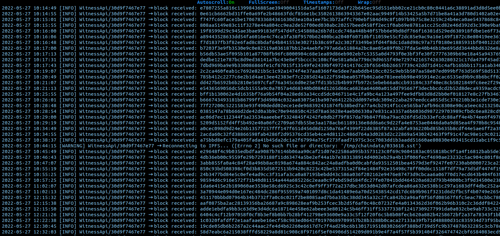 | 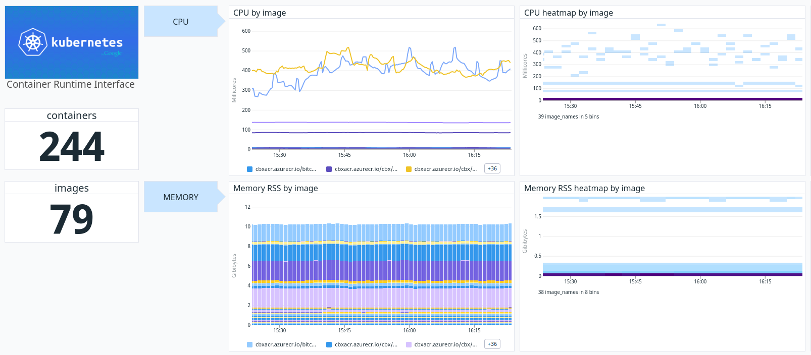

## Basic notions

### Observability 👁️

Observability is the ability of the internal states of a system to be determined by its external outputs. Full/100% observability means that there is no asymmetry of information between you, your team, your application, and your customer.

### Data collected 🖥️

In Datadog we collect different types of data:
- **Logs**: Log is an idempotent record of a discrete event that happened in a system at any point of time during the request life cycle. A log usually includes the timestamp and context payload for an event and can be emitted in various forms like plain text, structured format like json or binary logs.
- **Traces**: Tracing gives the capability to monitor the fate of a request during its lifecycle across various components in a system.
- **Metrics**: Metrics are the numeric representation like percentiles or the averages which help in monitoring the fate of a system holistically and are measured over an interval of time.

The power of Datadog resides in the intercorrelation and representation of these types of data in an environment where we can filter and manipulate all this information to produce valuable snaps.

### Five Ws ❓

The five Ws is something commonly used in journalism and is a useful technique to get a better approach and a more clear comprehension of an incident:

- <u>**W**hat happened</u>     -> Metrics 📏
- <u>Ho**W** it happened</u>   -> Traces 👣
- <u>**W**hy it happened</u>   -> Logs 📑
- <u>**W**here it happened</u> -> Tag of the data 🧭
- <u>**W**hen it happened</u>  -> Timestamp of the data 🕑

In Datadog the idea is that wherever we are and whatever is the data we are looking at, we should be able to answer those five questions.

### Technical intelligence (TI) 🧠

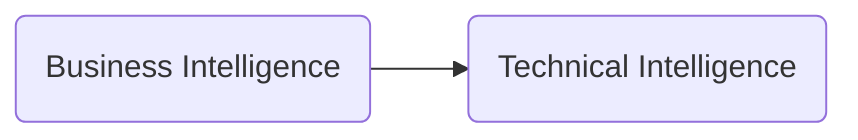
- **Business Intelligence (BI)**: comprises the strategies and technologies used by enterprises for the data analysis of business information
- **Technical Intelligence (TI)**: Like BI but over Technical Data, so it's TI.

## First steps with Datadog 🚶

### Collect information 🪣

The first step with Datadog is to collect all the information that we want to analyze and for that purpose, in the main panel we have the tab "[Integration](https://docs.datadoghq.com/getting_started/integrations/)". We use integrations to bring together all of the metrics and logs from our infrastructure and gain insight into the unified system as a whole _(we can see pieces individually and also how individual pieces are impacting the whole)_.

We have two types of integration:
- **Cloud-based integrations**:  we can intervene data directly with our cloud provider.
- **Agent-based integrations**: we deploy an agent in our cluster that will collect all the information.

Once we have set up our type of integration we then have documentation about the first steps and the different configurations of the tool itself.

In a containerized environment we use the [Autodiscovery integration](https://docs.datadoghq.com/getting_started/containers/autodiscovery/) and thanks to tags and annotations we can configure the agent.

### Visualize information 📈

In Datadog we have different approaches to visualize the different information that we have:

#### Infrastructure 🏗️

- **Host map**: It's a dashboard that allows us to view at first glance the status of the different hosts or containers integrated with Datadog.

> The host map is a heat map based also on entrypoint.

The different colors of each item are depending on the metrics that we are using at the moment. In this screen, there's a top bar to filter the results and we can realize the power of tags with Datadog. Thanks to tags we can filter and group our hosts and containers based on the tags and have a better understanding of our infrastructure, such as environment, tenant, platform, app and service among others.

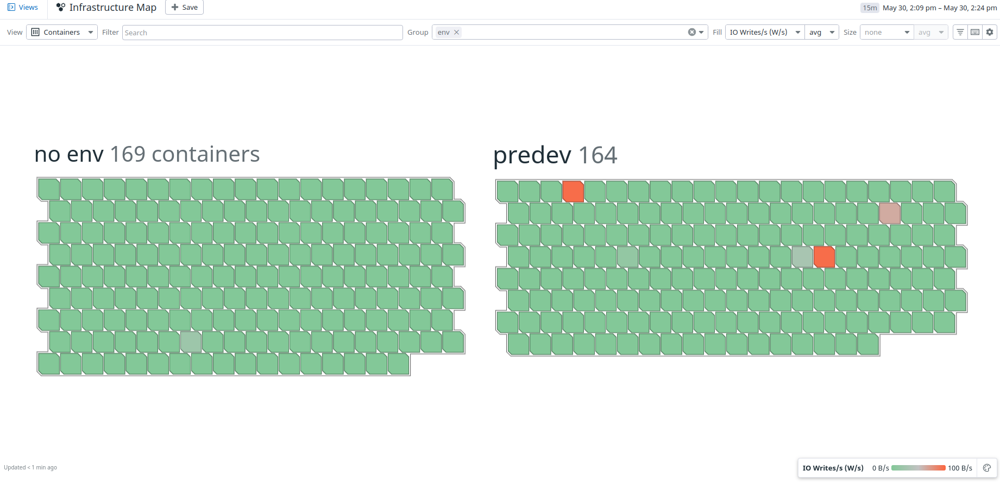
Container map detail | Host map detail
-|-
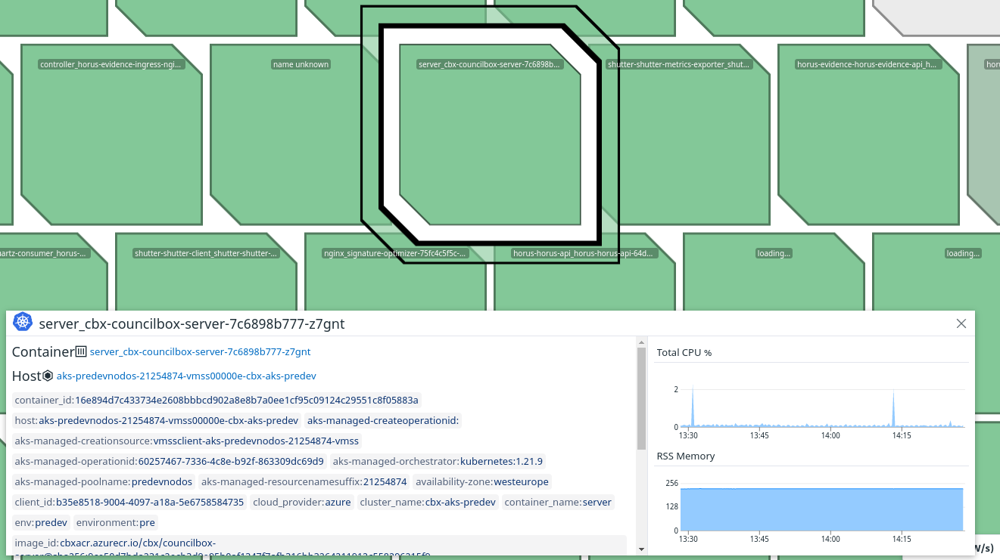 | 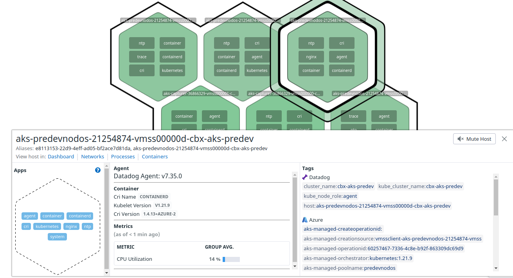

The host map is a heat map based also on the entrypoint.  If we zoom into the containers we can see all the tags that are being used and a small overview of the metrics that are displayed.

On the other hand, if we zoom on the containers we will see a detailed host map view, where we can see the application, and for each application we will be able to see the metrics and the logs if these are configured.

- **Host list**: It's the same as the host map but has a list with the tags, for a different view.
- **Containers**: This screen has all the information related to the containers in our infrastructure, and same as with the hosts, we can group and filter by tag or process.

Container infrastructure | Container detail
-|-
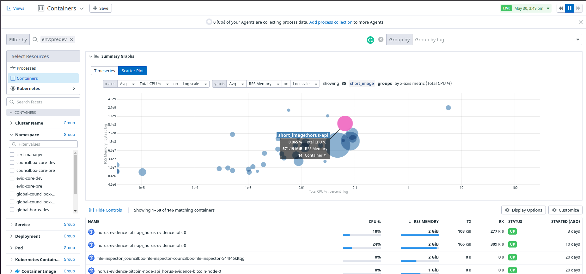 | 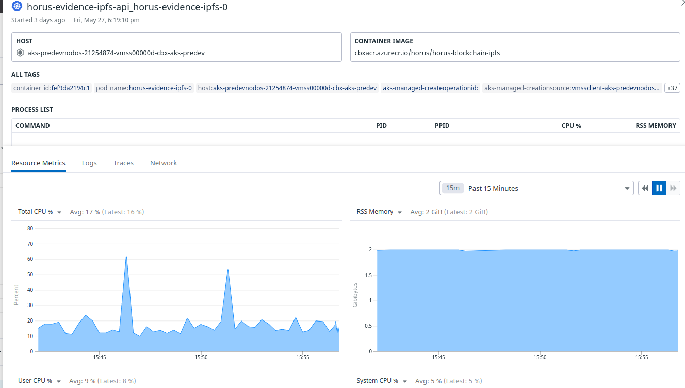

If we open a container we can see the process list, metrics, logs, traces and the network performance. The platform ideology is that we look at container metrics and we can watch the state, the with one click we go to the logs to get a better comprehension of the behavior, and then to the traces to see how those logs are generated.

- **Processes**: The process page is the exact same ideology as with containers.

#### Dashboards 📊

Infrastructure is one way to explore information, but usually dashboards are the better way to visualize that information.

For every set up integration Datadog creates a set of Dashboards. The predefined Dashboards are a good way to start, visualize information and learn about Dashboards and how to create personalized ones. The best way to learn is to read the documentation that comes with the Dashboard and interact with it, with all the widgets and the different variables.

> PRO tip: We can copy/paste our widgets to a web clipboard where we can navigate, export them to different dashboards and even copy/paste outside Datadog as a snapshot.

At the moment of creation we have 3 different options:
- **Dashboard**: Is the dashboard by default we can fully customize.
- **Timeboard**: This dashboard is more convenient for use and work with the data.
- **Screenboard**: Dashboard to have an instant view of the data and not touch it.

If we have an idea of the type of dashboard we want it's easier to choose one type of the prebuilt options. We put a title and once created we add a small description.

The most important step is to choose and configure the different widgets, which are the different modules that work with the data to produce views, graphs, charts... The widget configuration can be as complicated and precise as we want. We can take a look [here](https://docs.datadoghq.com/dashboards/widgets/) at the documentation.

We can personalize our queries, use filters, apply functions and even combine multiple queries.

> If we have a dashboard that is very generic we can play with **template variables** to reuse the same widget and produce a more dynamic tool.

### Monitor information 📺

#### Monitors 📺

The [monitors](https://docs.datadoghq.com/monitors/) actively check metrics, integration availability, network endpoints... We can configure monitors, notify our teams, and manage alerts at a glance on the Alerting platform.

At the moment of the monitor creation, we can choose between a wide range of options, each one defined specifically to a problem, situation or parameters.

The most commonly used is the [metric monitor](https://docs.datadoghq.com/monitors/create/types/metric/?tab=threshold), which analayze continuous streams of data, and can be alerted upon if they cross a threshold over a given period of time. 

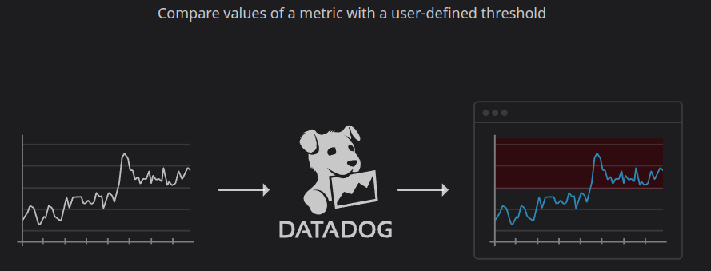

Another useful one is the [outlier monitor](https://docs.datadoghq.com/monitors/create/types/outlier/?tab=dbscan) which allows us to detect when a specific group is behaving differently compared to its peers. As an example, this is really useful when we have containers behind a load balancer, we can expect those containers to have similar behavior. If one starts to deviate from the majority of the group we can be notified.

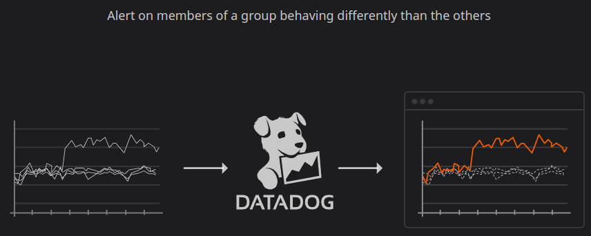

We configure the query for the monitor the same way we configure the dashboard, set alert conditions, notifications and destination.

> If we have set up an integration like Slack we can set an Slack endpoint with the '@' character

We can configure notifications based on the state of the monitor, the group that triggers, which notifications are sent to which endpoint and what are the values that are included in the notification.

We have full information about notifications in this [alerting section](https://docs.datadoghq.com/monitors/notify/).

With Manage Downtimes we can mute a monitor and prevent notifications to be sent. If we are doing a release or an upgrade we can schedule the downtime notification times. Another example could be to silence different environments such **PRE** or **DEV** during the weekends.

#### Logs 📑

Logging the important parts of your system’s operations is crucial for maintaining infrastructure health. The logs tell us **why** something is behaving this way.

We talked about the collection phase in the [collect information](#collect-information-) section, but we can also configure the collection of logs through the configuration page in the logs module.

In the logs page we have four different elements:

- **Context** on top: Formed by time section with the Live field and the search and group fields, to filter our results.
- **Visualization** at the bottom: define how the outcome of filter and aggregates are displayed
- **Facets** on the left: are user-defined tags and attributes from your indexed logs
- **Watchdog insights** in the middle: help resolve incidents by surfacing suspect anomalies, outliers, and potential performance bottlenecks impacting a subset of users.

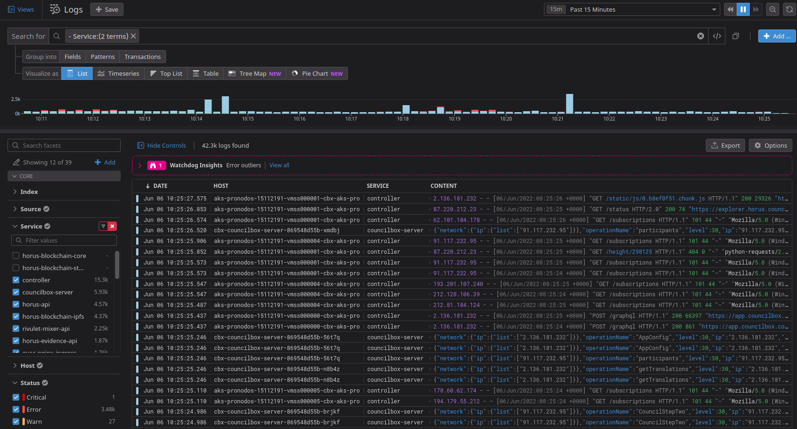

If we open a log we will see a [log side panel](https://docs.datadoghq.com/logs/explorer/side_panel/https://docs.datadoghq.com/logs/explorer/side_panel/). If we have our logs correctly parsed we can use the different tags as facets to filter, and even the traces, processes and metrics to correlate with all our data.

The most common uses for the log panel are to find a subset of logs and to understand what is happening on a specific log pool.

With the logs configuration panel we can define pipelines, how we ingest our logs, generate metrics and even rehydrate logs from archives. With pipelines we can even process the information before its indexation, then we can choose what is indexed and for how long and what's archived and how.

> There's a dashboard called Log Managment that have all complete information about logs in our system

